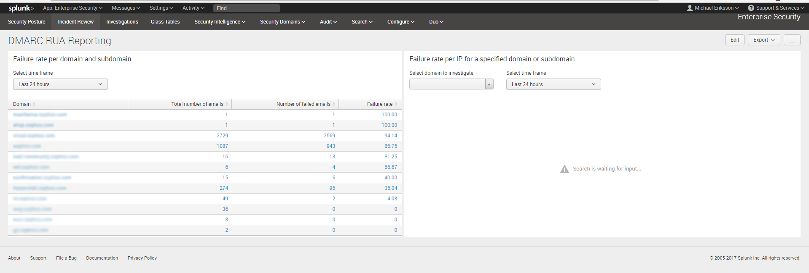

# dmarcparser
A quick and dirty implementation to get DMARC rua reports into Splunk for further analysis

Reads the emails from IMAP, transmogrifies the data and outputs it into Splunk. Simples.

## Requirements

* Python 2.7 (Since the Splunk SDK does not support Python 3 yet)
* Splunk SDK.
* A Splunk installation that can accept conncections via the SDK.
* A IMAP server that accepts connections on port 993 for secure connections.
* You will of course also need a dmarc record defined in your dns zone. If you don't know how to do that - Google is 
your friend. ;-) You can also have a look here: https://dmarc.org 

## Installation and configuration

### Installation
- Clone this repo onto your host
- Change directory into the program directory and run `pip install -r requirements.txt`

You can of course run this manually but I find that running it automagically is the best way. One way of accomplishing
this on Linux/Unix is as follows:
 - Create a file called `dmarcparser.sh` in the same directory as the `dmarcparser.py` file.
 - Edit that file to contain something like this:
~~~~
 #!/bin/sh
 python2.7 dmarcparser.py
~~~~
 - Once the file is created and saved, make sure to run `chmod +x dmarcparser.sh` to make sure that it is executable.
 - Then, as a user that have access to the dmarcparser directory and also can create and run crontab entries execute
 `crontab -e` and add a line looking something like this, of course adjusted to suit your host/directories etc:
~~~~
0 * * * * /home/user/Projects/dmarcparser/dmarcparser.sh
~~~~
 - The line above executes the script on the hour, every hour. As always, mileage may vary so you might have to adjust
 these things to suit your system. At least it should give you an idea of what you can do to get it scheduled.
 
### Configuration

Copy the `dmarcparser.ini.original` file to `dmarcparser.ini` and edit the following settings to suit your environment.

~~~~
[Splunk Config]
SplunkHost =
SplunkPort =
SplunkUser =
SplunkPassword =
SplunkIndex =
~~~~

~~~~
[Imap Config]
ImapServer =
ImapUser =
ImapPassword =
DeleteEmails = No
~~~~

These settings should be pretty self explanatory. If you change the 'DeleteEmails' setting to Yes the program will
delete the emails once they are processed. One way of keeping the Exchange mailbox in good shape. 

### Splunk examples

This is an example of a Splunk search that gives you a breakdown per domain over total amount of reported emails, number of failed ones and a failure percentage.

~~~~
index=dmarc sourcetype=dmarc_rua header_from=* 
| stats count(header_from) as total by header_from 
| append[search index=dmarc sourcetype=dmarc_rua (dkim_test!=pass AND spf_test!=pass) | stats count(header_from) as failed by header_from] 
| stats first(*) as * by header_from
| eval failurerate=round(((failed/total)*100),2)."%"
| table header_from total failed failurerate 
| sort - failurerate, total
| rename header_from as Domain, total as "Total number of emails", failed as "Number of failed emails", failurerate as "Failure rate" 
| fillnull
~~~~

I have also added a file called [dmarc_rua_report.xml](dmarc_rua_report.xml) which gives you a Dashboard with this search as well as one breaking down failures per IP on a specific domain. 

Example:

 

## Troubleshooting

By default the program logs errors and informational entries into the file `dmarcparser.log`. Review this one to try and find out why things are not working as expected.
 
If you need even more logging, edit the file `modules/logconfig.py` and in the snippet below, change the level from `INFO` to `DEBUG`.  

~~~~
        'loggers': {
            '': {
                'handlers': ['file'],
                'level': 'INFO',
                'propagate': True
            }
~~~~

## Known issues

### Incorrect XML
Some implementations seems to have incorrect XML syntax in them, which is not liked by the XML parser I'm using. There
might be a way around this but I really can't be bothered to spend too much time on it. Each one of these will be caught
by an exception and logged like this instead:

~~~~
2016-11-14 17:06:38,296 [ERROR] (parse_report): Error opening and parsing unpacked/emailgate.se!domain.com!1478646000!1478732400.xml. Most likely malformed XML.
~~~~

### Missing DKIM or SPF result entry
Some implementations seems to not include both the `Policy evaluated/dkim` and `Policy evaluated/spf` records. If that
is the case the value `Missing` is added in instead of the program crashing out and/or leaving it empty.

For any other problems or bugs - open an issue here on Github and I'll try to assist. Pull requests are of course also very welcome.
###### Disclaimer: This program does not come with any guarantees that it will actually work. Best efforts will be made to make it work as well as possible though.
